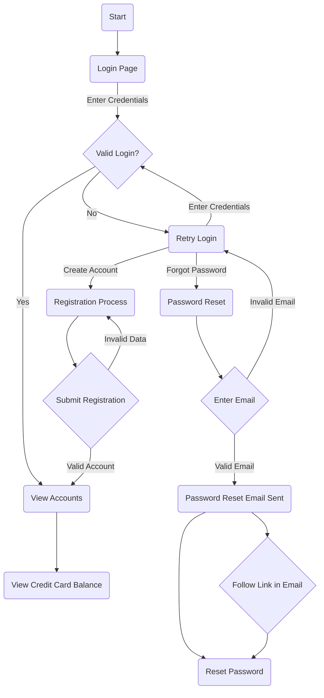

```mermaid
flowchart TD
    A(Start) --> B(Login Page)
    B -->|Enter Credentials| C{Valid Login?}
    C -->|Yes| D(View Accounts)
    C -->|No| E(Retry Login)
    E -->|Enter Credentials| C
    D --> F(View Credit Card Balance)
    E -->|Forgot Password| G(Password Reset)
    G --> H{Enter Email}
    H -->|Valid Email| I(Password Reset Email Sent)
    H -->|Invalid Email| E
    I --> J(Reset Password)
    I --> K{Follow Link in Email}
    K --> J
    E -->|Create Account| L(Registration Process)
    L --> M{Submit Registration}
    M -->|Valid Account| D
    M -->|Invalid Data| L
```