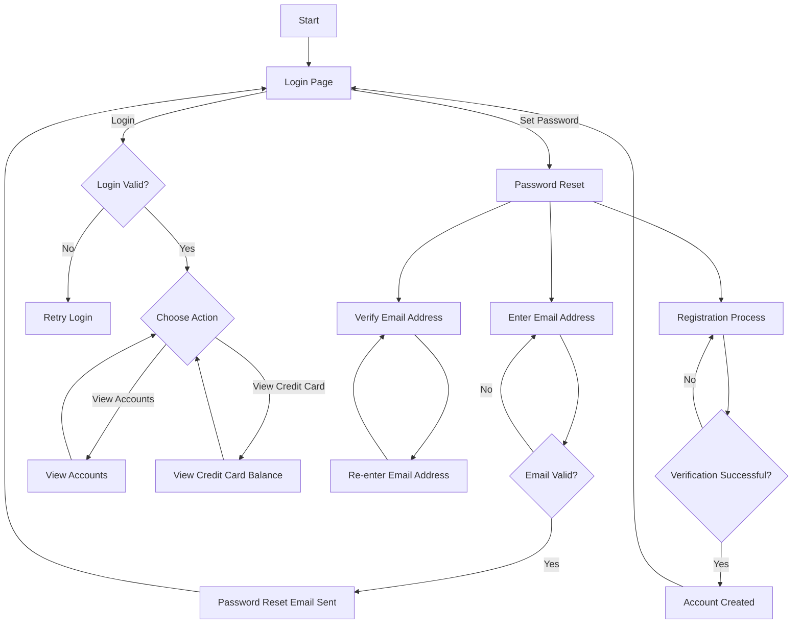

```mermaid
graph TD;
    A[Start] --> B[Login Page]
    B --> |Set Password| C[Password Reset]
    B --> |Login| D{Login Valid?}
    C --> G[Enter Email Address]
    G --> H{Email Valid?}
    H --> |Yes| I[Password Reset Email Sent]
    H --> |No| G
    I --> B
    D --> |No| E[Retry Login]
    D --> |Yes| F{Choose Action}
    F --> |View Accounts| J[View Accounts]
    F --> |View Credit Card| K[View Credit Card Balance]
    J --> F
    K --> F
    C --> L[Verify Email Address]
    L --> M[Re-enter Email Address]
    M --> L
    C --> N[Registration Process]
    N --> O{Verification Successful?}
    O --> |Yes| P[Account Created]
    O --> |No| N
    P --> B

```